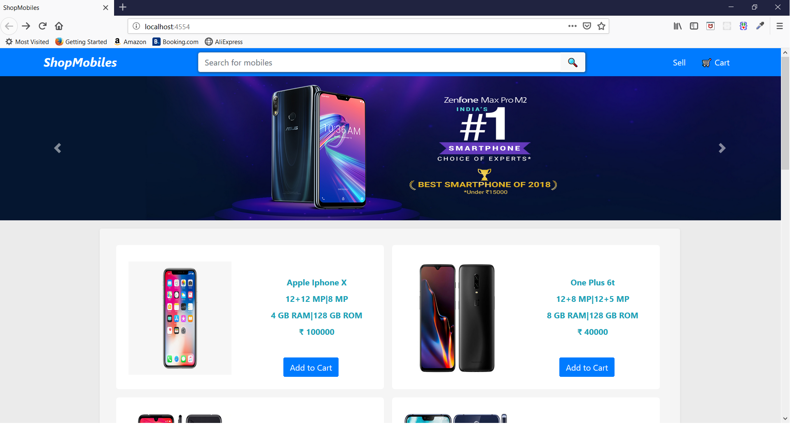

# Shop Mobiles
It is basically a shopping cart in which user can add a mobile 
to cart and also can remove the added product from the cart .
User can also search for mobiles. Seller can also add their products to the website .



---


---

Backend is made using NodeJS . MySQL is used for database . HTML , CSS , Bootstrap is used for frontend . To run the server you need to have node and mysql installed on your system perform the following steps.


To be performed on mysql
```sql 

create database shopdb;
create user shopper identified by 'shoppass';
use shopdb;
grant all priviliges on shopdb.* to shopper;


```

To be performed on powershell
```powershell

# Install dependencies
npm install

# Start server on localhost:4554
npm start

```

---


## Project Structure
    .
    ├── db                     # backend
    ├── public_html            # contains html and js files for frontend  
    ├── routes  
    |   ├── api                # rest api                
    │   |   ├── index.js       
    │   |   ├── login.js       
    │   └── └── signup.js       
    ├── server.js              # entry point
    └── ...


# App Info
### Author 
Shubham Singal

---

### Version 
1.0.0

